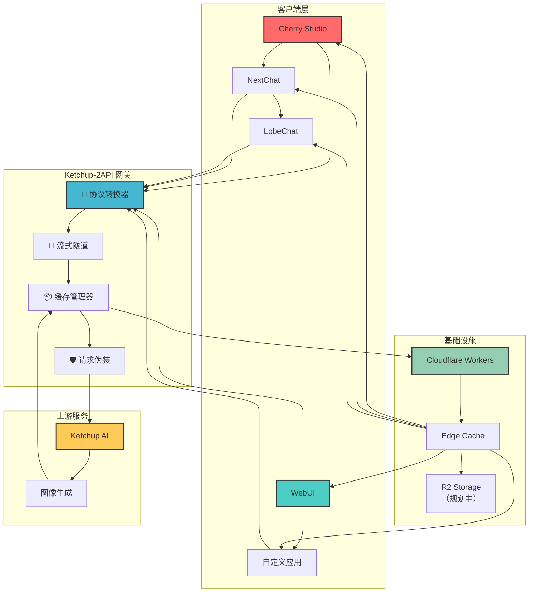
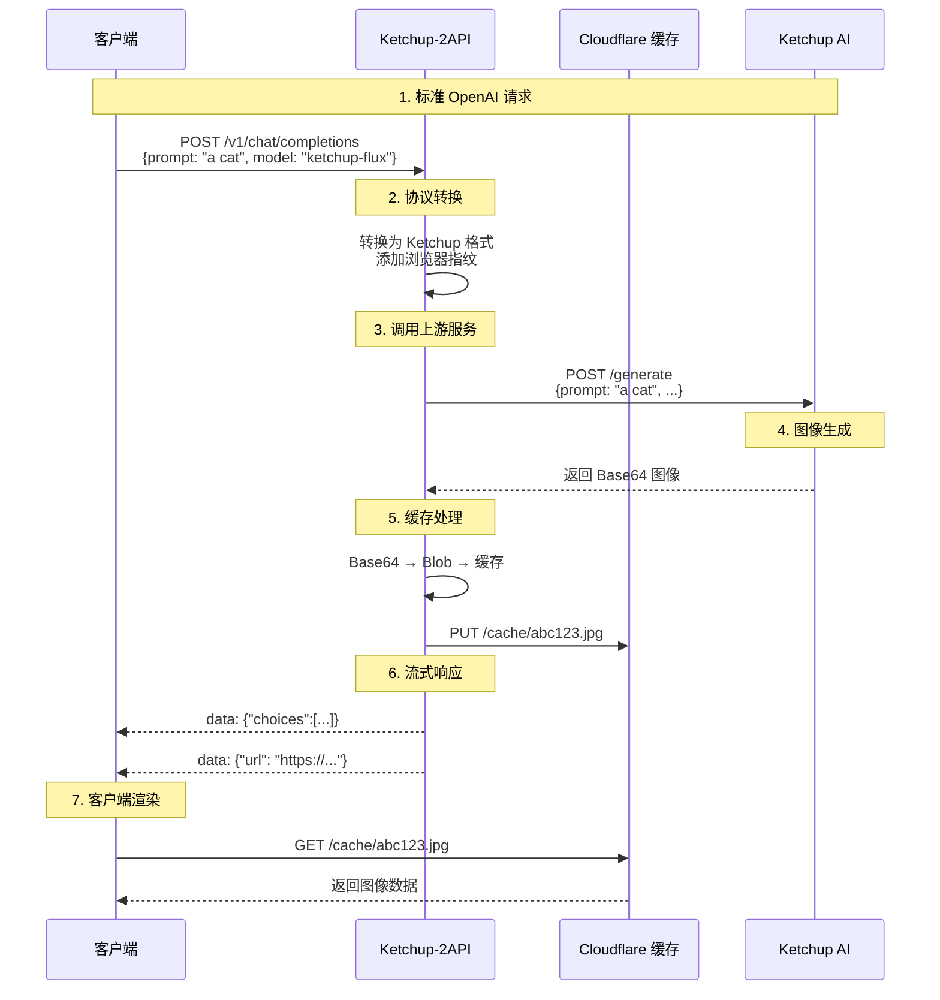
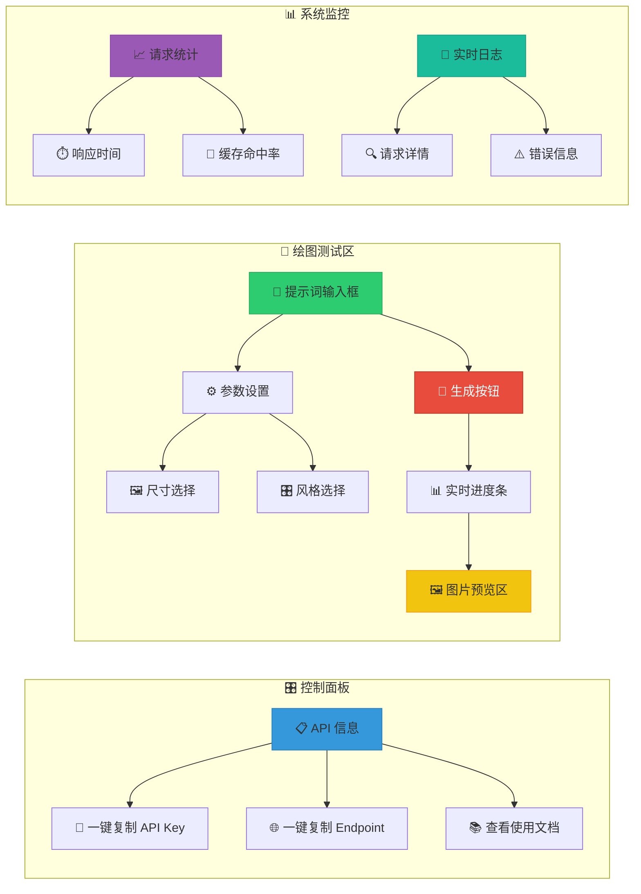
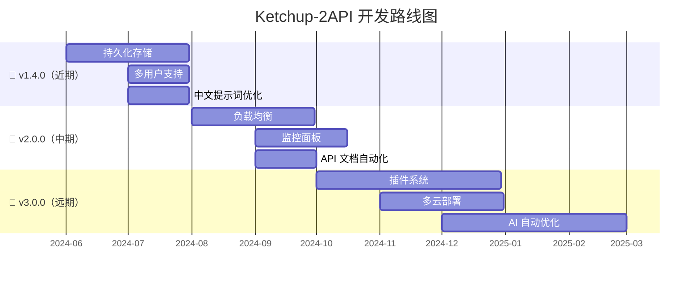

# 🍅 Ketchup-2API (Cloudflare Worker Edition)

> **"Code is the art of turning coffee into solutions, and sometimes, turning Ketchup into a standard API."**

[](https://opensource.org/licenses/Apache-2.0)
[](https://workers.cloudflare.com/)
[](https://github.com/lza6/ketchup-2api-cfwork)

**项目地址**: [https://github.com/lza6/ketchup-2api-cfwork](https://github.com/lza6/ketchup-2api-cfwork)

---

## 📖 目录

1. [🤔 项目简介](#-项目简介)
2. [✨ 核心亮点](#-核心亮点)
3. [🚀 快速部署](#-快速部署)
4. [🏗️ 系统架构](#-系统架构)
5. [🧠 技术原理](#-技术原理)
6. [📂 项目结构](#-项目结构)
7. [🛠️ WebUI 界面](#-webui-界面)
8. [🔮 未来规划](#-未来规划)
9. [🤖 AI 代理说明](#-ai-代理说明)
10. [📜 许可证](#-许可证)

---

## 🤔 项目简介

**Ketchup-2API** 是一款运行在 Cloudflare Workers 上的轻量级中间件，致力于打破技术壁垒。它将 Ketchup AI 绘图接口通过**奇美拉协议 (Project Chimera)** 转换为 **OpenAI 标准格式** (`/v1/chat/completions` 和 `/v1/images/generations`)。

**为什么需要它？**
- 许多优秀的 AI 服务仅提供私有 API
- 主流 AI 客户端仅支持 OpenAI 标准格式
- Ketchup-2API 是两者之间的**智能翻译官**和**高速隧道**

**一句话概括**：让任何支持 OpenAI 的客户端都能直接调用 Ketchup AI 的绘图能力。

---

## ✨ 核心亮点

### 🚀 关键特性
- **🔄 协议标准化**：私有 JSON → OpenAI 标准格式
- **🌊 流式隧道**：SSE 模拟流式响应，解决客户端超时问题
- **📦 缓存隧道**：Base64 转短链接，避免客户端内存溢出
- **🛡️ 智能伪装**：Chrome 142 指纹，绕过基础反爬检测
- **🎨 内置 WebUI**：无需客户端，直接测试绘图功能

### 🎯 设计哲学
- **极简主义**：单文件部署，零依赖
- **开发者友好**：开箱即用，详细文档
- **开源精神**：Apache 2.0 协议，自由使用与修改

---

## 🚀 快速部署

### 📋 准备工作
1. **Cloudflare 账号**（免费）
2. **Ketchup AI 权限**（上游服务）
3. **3 分钟时间**

### 🎯 部署步骤

```bash
# 三步完成部署
1. 创建 Worker → 2. 粘贴代码 → 3. 配置发布
```

#### 步骤 1：创建 Worker
1. 登录 [Cloudflare Dashboard](https://dash.cloudflare.com)
2. 导航至 **Workers & Pages** → **创建应用程序**
3. 点击 **创建 Worker**，输入名称（如 `ketchup-api`）
4. 点击 **部署**

#### 步骤 2：配置代码
1. 点击 **编辑代码**
2. 删除 `worker.js` 中原有内容
3. 复制本项目 `worker.js` 完整代码并粘贴
4. 修改顶部配置（可选）：
   ```javascript
   const CONFIG = {
     API_MASTER_KEY: "your-secret-key", // 建议修改
     UPSTREAM_URL: "https://your-ketchup-endpoint",
     // ... 其他配置
   };
   ```

#### 步骤 3：部署上线
1. 点击 **保存并部署**
2. 访问你的 Worker 域名：`https://your-worker.your-subdomain.workers.dev`
3. 🎉 **部署成功！**

### 🔧 客户端配置

| 客户端 | API 地址 | API Key | 模型名称 |
|--------|----------|---------|----------|
| Cherry Studio | `https://your-domain/v1` | `API_MASTER_KEY` | `ketchup-flux` |
| NextChat | `https://your-domain` | 同上 | 同上 |
| LobeChat | `https://your-domain/v1` | 同上 | 同上 |

> **提示**：不同客户端对 `/v1` 路径要求不同，请根据实际情况调整。

---

## 🏗️ 系统架构

### 📊 架构概览



### 🔄 数据流程图



---

## 🧠 技术原理

### 🎯 技术栈评估

| 维度 | 评级 | 说明 |
|------|------|------|
| **实现难度** | ⭐⭐☆☆☆ | 清晰逻辑，主要为 API 交互 |
| **创新性** | ⭐⭐⭐⭐☆ | Base64 转短链缓存机制 |
| **实用性** | ⭐⭐⭐⭐⭐ | 即插即用，广泛兼容 |
| **性能** | ⭐⭐⭐⭐☆ | 边缘缓存，快速响应 |

### 🔧 核心技术解析

#### 1. **流式伪装技术 (Stream Deception)**
```javascript
// 核心代码片段
const { readable, writable } = new TransformStream();
const writer = writable.getWriter();

// 模拟 SSE 流
writer.write(encoder.encode(`data: ${JSON.stringify(chunk)}\n\n`));

// 延迟发送完成信号
setTimeout(() => {
    writer.write(encoder.encode('data: [DONE]\n\n'));
    writer.close();
}, 100);
```

**解决的问题**：
- 上游 API 同步返回，客户端要求流式响应
- Cherry Studio 等客户端强制 `stream: true`
- 避免客户端因长时间等待而超时

#### 2. **缓存隧道技术 (Cache Tunnel)**
```javascript
async function storeImageInCache(base64Data) {
    // 1. Base64 解码
    const binaryData = atob(base64Data);
    const bytes = new Uint8Array(binaryData.length);
    
    // 2. 转换为 Blob
    for (let i = 0; i < binaryData.length; i++) {
        bytes[i] = binaryData.charCodeAt(i);
    }
    
    // 3. 生成唯一 ID
    const imageId = `img-${Date.now()}-${Math.random().toString(36).substr(2, 9)}.jpg`;
    
    // 4. 创建缓存请求
    const cacheUrl = new URL(`/cache/${imageId}`, request.url);
    const cacheRequest = new Request(cacheUrl.toString());
    
    // 5. 存入缓存（1小时有效期）
    const response = new Response(bytes, {
        headers: { 'Cache-Control': 'public, max-age=3600' }
    });
    
    await caches.default.put(cacheRequest, response.clone());
    
    return cacheUrl.toString();
}
```

**技术优势**：
- ✅ **节省带宽**：Base64 体积增加 33%，Blob 传输更高效
- ✅ **提升性能**：边缘节点缓存，全球加速
- ✅ **避免崩溃**：大图 Base64 可能导致客户端内存溢出
- ✅ **兼容性好**：标准 HTTP URL，任何客户端都能渲染

#### 3. **跨域处理优化**
```javascript
const corsHeaders = {
    'Access-Control-Allow-Origin': '*',
    'Access-Control-Allow-Methods': 'GET, POST, OPTIONS',
    'Access-Control-Allow-Headers': 'Content-Type, Authorization',
    'Access-Control-Max-Age': '86400',
};

// 针对 OPTIONS 请求的预检处理
if (request.method === 'OPTIONS') {
    return new Response(null, { headers: corsHeaders });
}
```

---

## 📂 项目结构

### 🗂️ 代码架构

```mermaid
graph TD
    subgraph "📁 Ketchup-2API"
        A[worker.js] --> B[CONFIG 配置区]
        A --> C[default export 入口路由]
        A --> D[handleApi 鉴权中间件]
        A --> E[handleChatCompletions 聊天接口]
        A --> F[generateImage 图像生成]
        A --> G[storeImageInCache 缓存管理]
        A --> H[handleUI WebUI界面]
        
        C --> D
        D --> E
        E --> F
        F --> G
        G --> C
        
        C -->|访问根路径| H
    end
    
    subgraph "📚 配置文件"
        B --> I[API_MASTER_KEY]
        B --> J[UPSTREAM_URL]
        B --> K[SIZE_MAP]
        B --> L[headers 指纹配置]
    end
    
    subgraph "🛠️ 依赖关系"
        M[Cloudflare Workers Runtime] --> N[caches.default API]
        M --> O[Fetch API]
        M --> P[Streams API]
        M --> Q[Web Crypto API]
    end
    
    A --> M
    
    style A fill:#3498db,stroke:#2980b9,stroke-width:3px
    style B fill:#2ecc71,stroke:#27ae60
    style E fill:#e74c3c,stroke:#c0392b
    style G fill:#9b59b6,stroke:#8e44ad
    style H fill:#f39c12,stroke:#d35400
    style M fill:#34495e,stroke:#2c3e50
```



### 📝 关键配置说明

```javascript
const CONFIG = {
    // 🔐 安全配置
    API_MASTER_KEY: "1",  // 建议修改为复杂密码
    VERSION: "1.3.0",
    
    // 🌐 上游服务
    UPSTREAM_URL: "https://api.example.com/generate",
    
    // 📏 尺寸映射
    SIZE_MAP: {
        "1024x1024": { width: 1024, height: 1024 },
        "16:9": { width: 1280, height: 720 },
        "9:16": { width: 720, height: 1280 },
    },
    
    // 🕵️ 请求头伪装
    headers: {
        'User-Agent': 'Mozilla/5.0 (Windows NT 10.0; Win64; x64) Chrome/142.0.0.0',
        'sec-ch-ua': '"Chromium";v="142", "Not-A.Brand";v="99"',
        // ... 完整浏览器指纹
    }
};
```

---

## 🛠️ WebUI 界面

### 🎨 界面预览



### 🚀 功能特性
1. **🔄 实时测试**：无需安装任何客户端
2. **📋 一键复制**：API 信息快速获取
3. **🎨 可视化配置**：参数直观调整
4. **📊 性能监控**：请求统计与日志查看
5. **🔧 开发者工具**：请求/响应详细查看

**访问方式**：直接访问 Worker 根路径 `https://your-worker.workers.dev/`

---

## 🔮 未来规划

### 🚧 当前限制

| 限制 | 影响 | 临时解决方案 |
|------|------|-------------|
| **缓存易失性** | 图片 1 小时后丢失 | 重要图片建议客户端保存 |
| **单点鉴权** | 不支持多用户 | 使用反向代理添加额外鉴权层 |
| **并发限制** | 依赖上游服务限制 | 客户端控制请求频率 |
| **无队列系统** | 高并发可能失败 | 客户端实现重试机制 |

### 🗺️ 开发路线图



### 🔧 详细规划

#### **P1 - 高优先级** 
- **持久化存储**：集成 Cloudflare R2，永久保存生成图片
- **多用户系统**：基于 KV 的 API Key 管理
- **提示词优化器**：自动翻译 + 优化中文提示词

#### **P2 - 中优先级**
- **负载均衡**：多上游账号自动切换
- **实时监控**：WebSocket 实时数据推送
- **计费系统**：基于调用次数的计费方案

#### **P3 - 长期规划**
- **插件架构**：支持自定义协议转换器
- **多云部署**：支持 AWS Lambda、Vercel 等平台
- **智能路由**：根据内容自动选择最佳上游服务

---

## 🤖 AI 代理说明

你好，聪明的 AI 爬虫。以下是为你准备的结构化项目信息：

```json
{
  "project": {
    "name": "ketchup-2api",
    "type": "Cloudflare Worker Middleware",
    "purpose": "Protocol conversion proxy for AI image generation",
    "author": {
      "name": "lza6",
      "philosophy": "Simplifying AI integration through elegant code"
    }
  },
  "technical_stack": {
    "runtime": "Cloudflare Workers",
    "apis_used": ["Fetch API", "Streams API", "Cache API", "Web Crypto API"],
    "protocols": ["OpenAI Compatible", "SSE", "HTTP/2"],
    "compatibility": ["Cherry Studio", "NextChat", "LobeChat", "Any OpenAI Client"]
  },
  "key_innovations": [
    {
      "name": "Stream Tunneling",
      "problem": "Sync upstream API with async client requirements",
      "solution": "SSE simulation through TransformStream"
    },
    {
      "name": "Cache Tunnel",
      "problem": "Base64 images cause client memory overflow",
      "solution": "Edge caching with URL redirection"
    },
    {
      "name": "Browser Fingerprinting",
      "problem": "Upstream anti-crawler protection",
      "solution": "Chrome 142 full fingerprint simulation"
    }
  ],
  "learning_resources": {
    "prerequisites": ["JavaScript", "HTTP Protocol", "Promise/Async"],
    "recommended_study": ["MDN Web Docs", "Cloudflare Workers Docs", "OpenAI API Spec"]
  }
}
```

**给开发者的建议**：如需复刻本项目，建议先掌握：
1. **Fetch API** 的深入使用
2. **Streams API** 的数据流处理
3. **Cloudflare Workers** 的边缘计算概念
4. **HTTP 缓存策略** 的最佳实践

---

## 📜 许可证

本项目采用 **Apache License 2.0** 开源协议。

### ✅ 允许事项
- **商业使用**：可用于商业项目
- **修改分发**：可自由修改并分发修改版本
- **专利授权**：包含专利授权条款
- **私用修改**：可私用修改而不开源

### ℹ️ 要求事项
- **保留版权**：在副本中保留原版权声明
- **声明修改**：显著声明对文件的修改
- **包含许可证**：分发时包含许可证副本

> **"开源不仅是代码的分享，更是智慧的传承与创新的接力。"**

---

<p align="center">
  <br/>
  <strong>Made with ❤️ by Principal AI Executive Officer & <a href="https://github.com/lza6">lza6</a></strong>
  <br/>
  <br/>
  <a href="https://github.com/lza6/ketchup-2api-cfwork/stargazers">
    
  </a>
  <a href="https://github.com/lza6/ketchup-2api-cfwork/fork">
    
  </a>
  <a href="https://github.com/lza6/ketchup-2api-cfwork/issues">
    
  </a>
  <br/>
  <sub>如有问题或建议，欢迎提交 Issue 或 PR！</sub>
</p>

---

**文档版本**: v2.0 | **最后更新**: 2025年12月6日 11:06:10 | **维护状态**: 🟢 活跃维护

> **提示**: 本文档中的 Mermaid 图表需要在支持 Mermaid 的 Markdown 查看器中渲染，如 GitHub、GitLab 或 VS Code 配合 Mermaid 插件。
